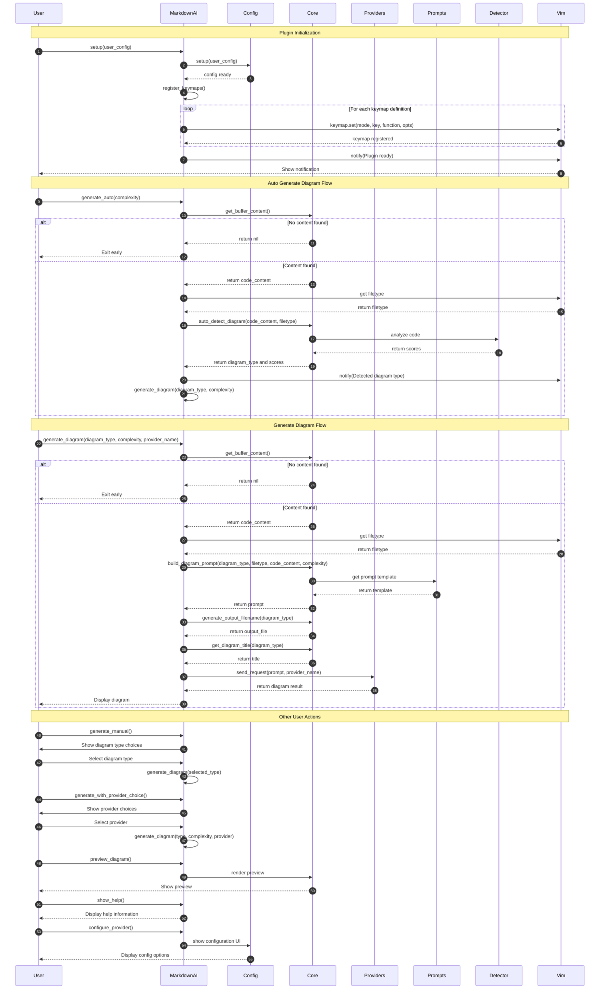

# markdown-ai - Sequence

**Generated**: 2026-04-03 21:07:57
**Source**: markdown-ai.lua
**Provider**: Claude

```mermaid
sequenceDiagram
    autonumber
    participant User
    participant M as MarkdownAI
    participant Config
    participant Core
    participant Providers
    participant Prompts
    participant Detector
    participant Vim

    Note over User,Vim: Plugin Initialization

    User->>M: setup(user_config)
    M->>Config: setup(user_config)
    Config-->>M: config ready
    M->>M: register_keymaps()
    
    loop For each keymap definition
        M->>Vim: keymap.set(mode, key, function, opts)
        Vim-->>M: keymap registered
    end
    
    M->>Vim: notify(Plugin ready)
    Vim-->>User: Show notification

    Note over User,Vim: Auto Generate Diagram Flow

    User->>M: generate_auto(complexity)
    M->>Core: get_buffer_content()
    
    alt No content found
        Core-->>M: return nil
        M-->>User: Exit early
    else Content found
        Core-->>M: return code_content
        M->>Vim: get filetype
        Vim-->>M: return filetype
        M->>Core: auto_detect_diagram(code_content, filetype)
        Core->>Detector: analyze code
        Detector-->>Core: return scores
        Core-->>M: return diagram_type and scores
        M->>Vim: notify(Detected diagram type)
        M->>M: generate_diagram(diagram_type, complexity)
    end

    Note over User,Vim: Generate Diagram Flow

    User->>M: generate_diagram(diagram_type, complexity, provider_name)
    M->>Core: get_buffer_content()
    
    alt No content found
        Core-->>M: return nil
        M-->>User: Exit early
    else Content found
        Core-->>M: return code_content
        M->>Vim: get filetype
        Vim-->>M: return filetype
        M->>Core: build_diagram_prompt(diagram_type, filetype, code_content, complexity)
        Core->>Prompts: get prompt template
        Prompts-->>Core: return template
        Core-->>M: return prompt
        M->>Core: generate_output_filename(diagram_type)
        Core-->>M: return output_file
        M->>Core: get_diagram_title(diagram_type)
        Core-->>M: return title
        M->>Providers: send_request(prompt, provider_name)
        Providers-->>M: return diagram result
        M-->>User: Display diagram
    end

    Note over User,Vim: Other User Actions

    User->>M: generate_manual()
    M->>User: Show diagram type choices
    User->>M: Select diagram type
    M->>M: generate_diagram(selected_type)

    User->>M: generate_with_provider_choice()
    M->>User: Show provider choices
    User->>M: Select provider
    M->>M: generate_diagram(type, complexity, provider)

    User->>M: preview_diagram()
    M->>Core: render preview
    Core-->>User: Show preview

    User->>M: show_help()
    M-->>User: Display help information

    User->>M: configure_provider()
    M->>Config: show configuration UI
    Config-->>User: Display config options
```
